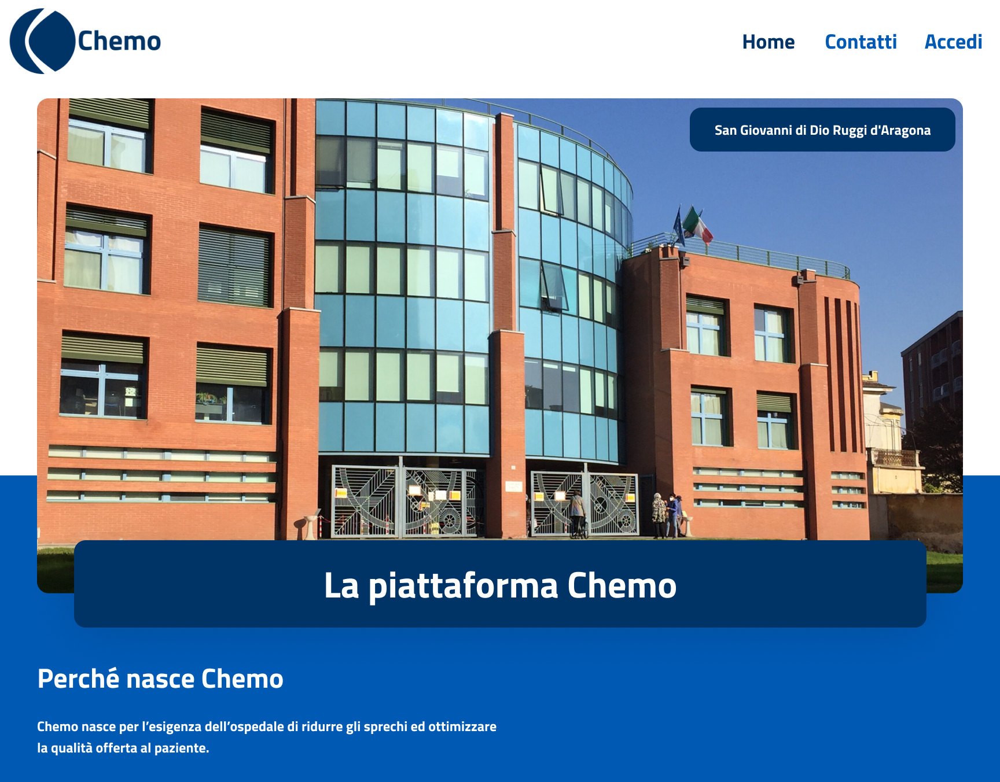

## Agorà

Social network for activism groups developed as a _Human-machine Interaction_ exam project.

### Software documentation and code

All the code of the software prototype is publicly available on the [Agorà GitHub page](https://github.com/amarcone42/agora). No software documentation has been made, only design documentation, available in the same repository in the [documentation](https://github.com/amarcone42/agora/tree/master/documentation) section.

### Purpose of the software

The aim of the software is to provide communities of social activism with a platform where they can connect remotely, publishing news, events and communicating with each other.
The project was developed starting from the theme of _"Engagin Community and Inclusion"_.

### Aim of the exam project

The focus of the exam project was to analyze the chosen reference community and design a system taking into account the needs of the users, to provide an optimal user experience. The exam allowed to learn the use of **Figma**, interface design techniques and user experience.

### Role in the group

My role in the group was both _group manager_ and _design manager_. This allowed me to experience not only group management but also overseeing all design decisions.

## Chemo

Scheduling and appointment management platform for a chemotherapy department developed as a _Software Engineering_ exam project.

### Software documentation and code

All the code of the software prototype is publicly available on the [Chemo GitHub page](https://github.com/Claudiabuono/Chemo). The exam documentation is available in the same repository in the [documentation](https://github.com/Claudiabuono/Chemo/tree/master/documentation) section.

### Purpose of the software

The purpose of the system is to provide workers in the oncology department with a service that drastically improves the process for carrying out chemotherapy, including the development of a calendar and the management of medicines to carry out the therapies. These operations, being carried out by specific employees, require profound digitalization in order to be improved.
The use of digital software allows interaction with an artificial intelligence module that can optimize the use of medicines and better management of the available armchairs.

### Role in the group

My role in the group was  _front-end developer_. This allowed me to improve my skills in user interface design and implementation. 
